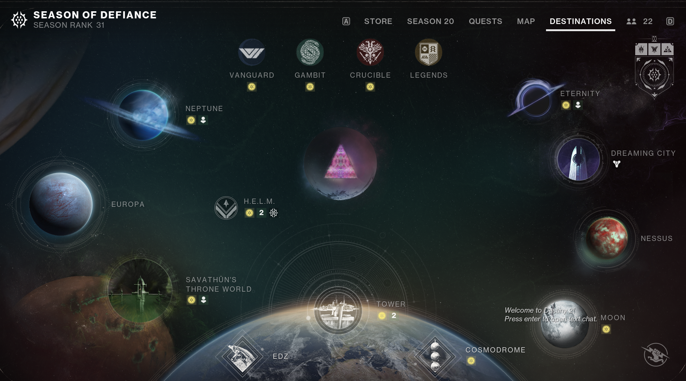
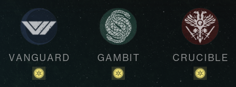
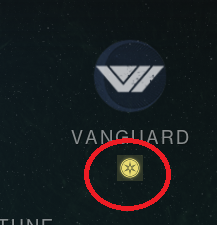

Navigation & Challenges
=======================

The Director
------------

This screen is called The Director. You get to it by holding the Tab button on keyboard (folks with controllers please add the key control.) Except for the logos across the top (Vanguard, Gambit, Crucible, Legends, and Eternity) everything here is known as a Destination. The community more or less uses the names you see here to refer to these areas. (Savathun's Throne World is the exception, we just call that Throne World, and it has a sub-destination called the Enclave.)

Ritual Activities
-----------------

Calling attention to this trio of icons because these are the so-called "Ritual Activities." You'll be playing a lot of these because they're the primary repeatable content. Each of these have a sub screen I'll explain the nodes of in a future guide.

Challenges
----------

These gold stars that you can see on many destinations mean that destination or activity have available challenges. Challenges are the primary way to raise your power level. The key ones if you're not "high level" are going to be the ritual challenges.

.. figure:: challenge-details.png

When the challenge is associated with an activity, hovering over the activity will pull up a description that has the challenge underneath. This gold box explains how to complete the challenge. In this case, it's the basic Vanguard ops challenge (one of the ritual challenges) and all you need to do is play strikes or nightfalls using a subclass (energy type of your abilities) matching the current Surge. Then after the description is the progress bar. Not all challenges have them (Raid challenges typically are "complete the final encounter" so don't need one.)

After that it shows you what kind of gear you get from the challenge. All of these will be from the World Pool, but the Powerful (Tier 1) to Pinnacle are a little obtuse. In general, it's whatever your top average gear level is plus some value. The value shifts based on where in the power grind you are and will need to be explained on its own. In general, higher tiers are better and pinnacle is better than powerful.

.. figure:: vendor-challenges.png

These symbols means that the vendor has a vendor challenge. Most of the time a vendor challenge is "do a certain number of bounties" though there are exceptions. They look just like standard challenges when you hover over the vendor.

Quests
------

.. figure:: quest-icon.png

These little icons are "quest" icons and tell you either someone wants to give you a quest, or the objective for a quest in your quest screen is on this location. The icon is usually which content the quest is associated with. This one is Season of Defiance, but if you did the lightfall campaign, it had a little pyramid symbol.
