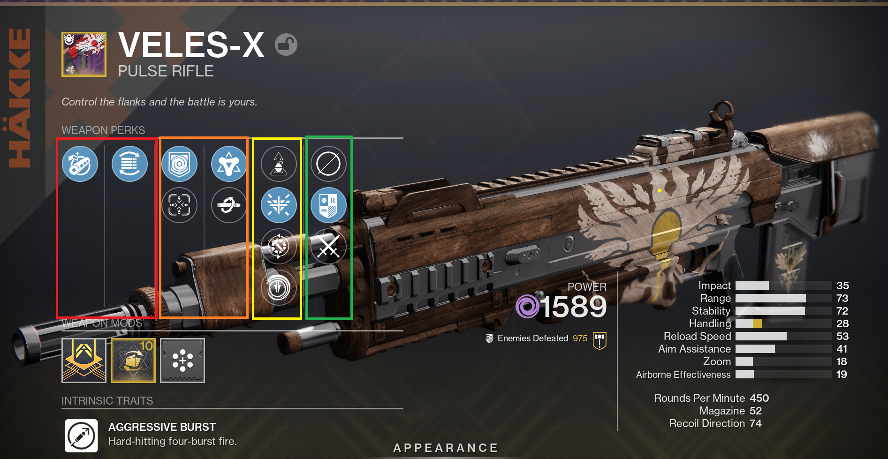

Piper's Guide to Weapons
========================

Top
---

Red: Intrinsic perks, specific to the weapon type, usually barrel and mag or mag and scope.

Orange: Weapon perks, when folks are talking about most perks, this is what they mean. This one has Repulsor Brace (which gives me a shield when I kill a debuffed enemy) and Golden Tricorn (Which gives my abilities a boost.)

Yellow: This column is called the "origin" perk. Most guns only have one which is the foundry that designed the gun in game. In the case of Veles-x, that's Hakke, and that's the top perk with the grenade logo. The other three are Vanguard, Crucible, and Gambit, because this is called a ritual weapon.

Green: Kill trackers. Top one is "no tracker", then combatants (non-players) and pvp.

Bottom
------

.. figure:: weapons-bottom.png

Orange: Weapon type/family broad categories: Pulse Rifles are multi-round burst medium-long rifles.

Red: Intrinsic/"frame": The "sub-type" of the gun. Aggressive Pulse rifles fire four rounds instead of 3 which is normal. An exotic (Vigilance Wing) does 5 round bursts. Sometimes people refer to this via the rounds per minute stat because they are largely linked.

Yellow: Infuse (power up) the item by sacrificing a higher power item of the same type (As in "energy weapon" not "pulse rifle"). The next square is the Masterwork, which is an upgradeable value that can upgrade 1 stat on the gun by up to 10. And the right is the mod slot.

Frame detail: "Adaptive" is the "base model" of a family

Stats
-----
All weapons stats are 0-100 and have a hidden curve based on the weapon. So 0 Impact isn't "No damage" it's "minimum damage for the weapon archtype (see weapon frame.)

Impact: Damage.

Range: Damage falloff. Affects range of maximum damage, and how far the minimum damage is.

Stability: How much the recoil kicks.

Handling: How quickly you can draw the weapon when switching weapons and how fast you get back from jumps or throwing abilities to being able to shoot.

Reload Speed: As the tin says.

Aim Assistance: Bullet magnetism cone is affected by this. Higher means you can be wider from the target.

Zoom: How much magnification you get when you aim down sights.

Airborne Effectiveness: Shooting in the air lowers aim assistance and a few other stats, making this higher reduces the penalties.

Rounds Per Minute: Fixed per archetype, number of bullets you can shot in a minute (assuming no reloading.)

Magazine: How many shots before you reload.

Recoil Direction: Needs an essay, but 100 is minimal recoil and directly vertical. Under that 1-4 aims left 5 is vertical and 6+ is right leaning. Every ten you go down increases the amount of recoil the gun has. (Stability reduces this inherent kick.)

Detail: Archetypes have ranges that they fit in, so there's a minimum value and a maximum value a given weapon might have based on its archetype but can differ from model to model. Guns of the same name have the same base stats modified by the intrinsic perks and masterwork.
